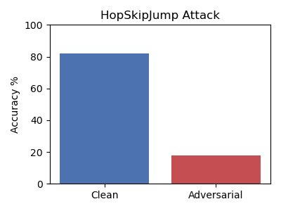
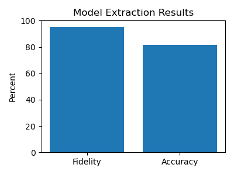
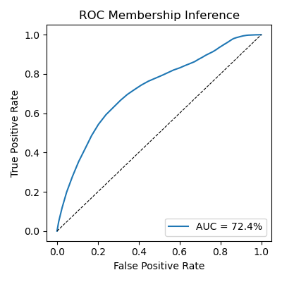

# Banking ML Attacks PoC
[](https://github.com/proovethetruth/POC-Banking-ML-Attacks/actions/workflows/ci.yml)  
[](LICENSE)

**Proof-of-Concept** моделирует три класса атаки на простую ML-модель кредитного скоринга. Здесь же собраны выводы по mitigation strategies и тонкостям атаки

Цель: понять, как уязвимости моделей проявляются в реальных задачах, и на какие признаки стоит обращать внимание при продакшн-развёртывании

---

## 📈 Ключевые результаты
> Простая табличная модель скоринга может быть легко атакована:  
> от снижения качества на 64 % (HopSkipJump) до утечки приватности клиентов (MIA)

### 🧨 1. Decision-based Adversarial Attack (HopSkipJump)

- **Clean Accuracy:** 82.0 %  
- **Adv. Accuracy:** 18.0 %



---

### 2. Model Extraction Attack

- **Fidelity (surrogate vs victim):** 95.4 %  
- **Surrogate Accuracy:** 81.7 %



---

### 🔓 3. Membership Inference Attack

- **Threshold:** 0.93  
- **Attack Accuracy:** 55.6 %  
- **AUC:** 72.4 %



---

## 🚀 Быстрый старт

```bash
git clone https://github.com/proovethetruth/POC-Banking-ML-Attacks.git
cd POC-Banking-ML-Attacks

# Локально через Makefile
make setup        # ставит Python-зависимости
make all          # train + все PoC-атаки + генерация summary.png

# Или в Docker
docker build -t poc-banking-ml-attacks .
docker run --rm poc-banking-ml-attacks
````

---

## Структура проекта

```
├── src/
│   ├── model_train.py
│   ├── extraction_attack.py
│   ├── membership_attack.py
│   ├── adversarial_tabular_attack.py
│   └── report.py
├── data/                        # raw + preprocessed
├── results/
│   ├── extraction_plot.png
│   ├── membership_roc.png
│   ├── tabular_adv_plot.png
├── docs/                        # defenses, architecture, findings
├── Makefile
├── Dockerfile
├── requirements.txt
└── README.md
```

---

## ⭐ Основные выводы
Все технические детали и выводы описаны в [docs/findings.md], а рекомендации по защите — в [docs/defenses.md].

- Без rate-limiting и adversarial training модель легко сломать через HopSkipJump (Decision-based Adversarial), даже не зная её градиентов
- По "чёрному" API можно обучить surrogate-модель с fidelity ~95% и accuracy ~82% на оригинальных данных (Model Extraction)
- Простейший threshold-based подход к Membership Inference даёт AUC >72% и позволяет узнать, какие клиенты были в тренировочном наборе 

## Что дальше
Проект не претендует на полноту покрытия всех классов угроз, но демонстрирует, насколько низкий порог входа у атак на ML-модели даже без доступа к коду или градиентам

Возможные направления для развития:
* **Интеграция защит**: реализовать и сравнить методы детектирования атак (confidence thresholding, anomaly detection, DP defense и др.)
* **Оценка устойчивости** в реальных условиях продакшн-среды (например, с ограничением числа запросов, добавлением логирования и алертов)
* **Интерфейс для сценарного запуска**: минимальный API, позволяющий имитировать атаки на модель в изолированной среде (полезно для обучения и демонстраций внутри команды)
